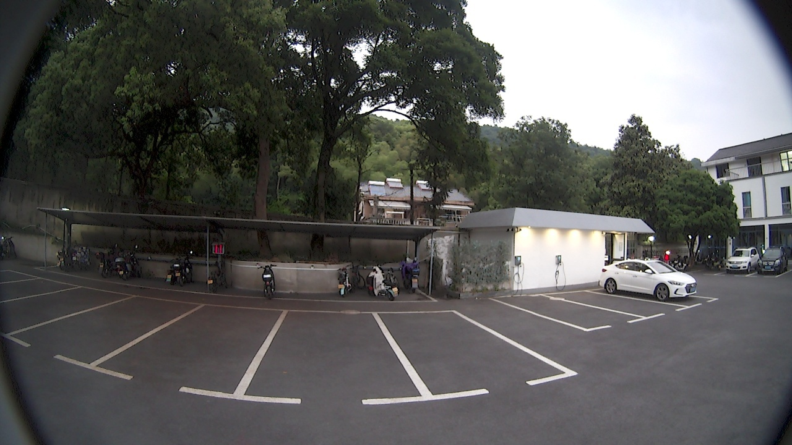
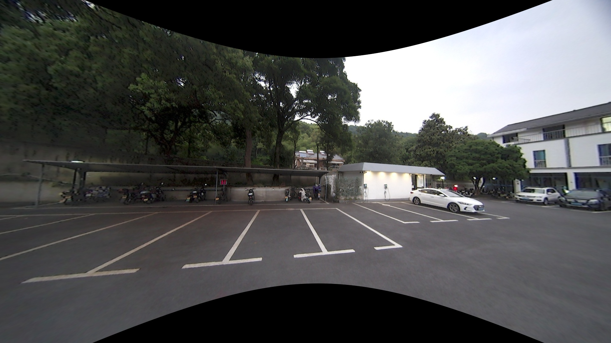

## image_undistort_tool

MEI相机去畸变工具

### 介绍

- 原始图像



- 去畸变图像



### 依赖

- ros-melodic

- Eigen3

- OpenCV3.2+

- CERES 2.0.0

- [camera_calib](./Thirdparty/camera_calib)

  该仓库为相机模型仓库，也可用于相机标定

### 编译

```shell
mkdir -p image_undistort_tool/src
cd image_undistort_tool/src
cp -r ./image_undistort_tool/Thirdparty/camera_calib ./
cd ..
catkin_make
```

### 使用

#### 使用说明

1. 将`test_data`中的路径/数据更换为目标数据

2. 根据焦距与市场角计算`undistort_scale`，

   目标焦距 = 内参焦距/ `undistort_scale`

3. 程序运行时，根据提示信息进行保存

   根据需求开启或关闭`check_first_frame`/`check_every_frame`

4. 若原始图像分辨率与内参中分辨率不同，会自动将原始图像resize至内参分辨率

#### 测试数据

​	[test_data](./test_data/NC_1.1_001)

#### 运行

```shell
source devel/setup.zsh
roslaunch image_undistort_tool undistort_image.launch
```

### TODO

- [ ] 代码重构
- [ ] 增加支持不同分辨率图像的去畸变